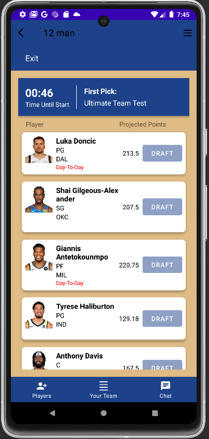
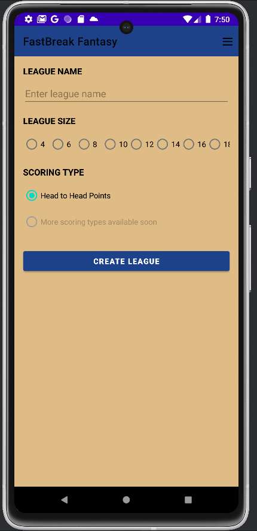
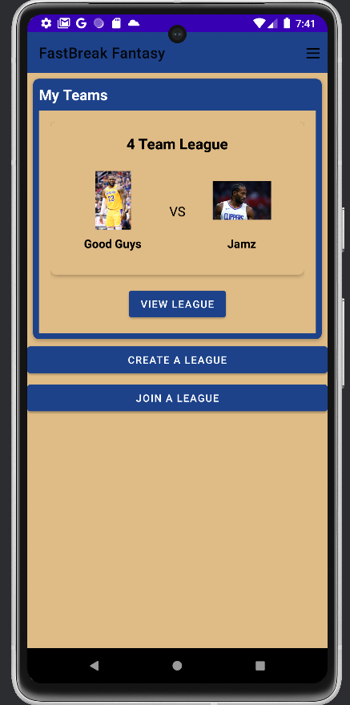
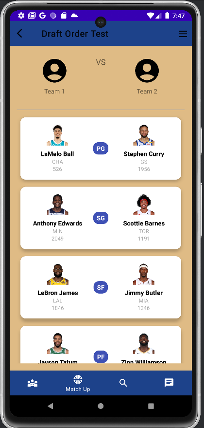
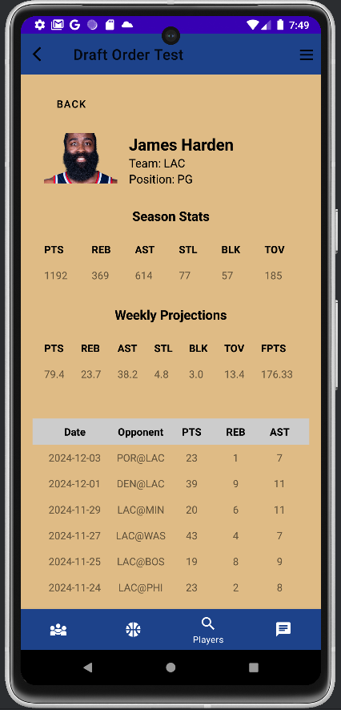
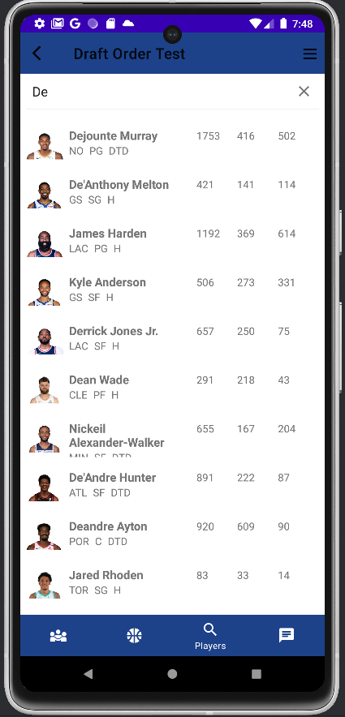
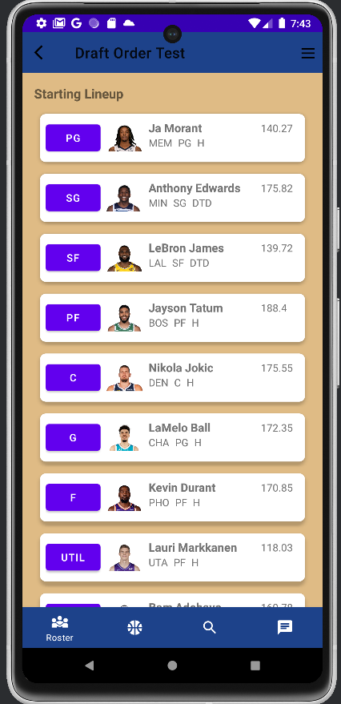

# FastBreak Fantasy

_A fantasy basketball league creator application_

---

## Overview

This project is a **Fantasy Basketball application** built in **Kotlin** for Android as part of our Computer Science Senior Project. The app allows users to create leagues, invite their friends, draft NBA players, set their weekly lineups, and compete against friends in a head-to-head format. 

It was developed by a team of four students with the goal of combining real-time NBA data with a smooth user experience.

This project gave us hands-on experience with the **Agile Software Development Lifecycle**, full-stack mobile development, team collaboration, and delivering a complex product on a deadline.

---

## Features

- Google Sign In and standard email/password sign in using firebase
- Create a league and invite your friends by sharing a unique generated code
- Live draft rooms with updated rosters and stats
- Set weekly line ups and bench the players you don't want by comparing projections
- Add or drop a player from your team and pick from the unchosen players in the pool
- Search for a player in the list of active nba players and view their averages and recently played games
- Propose a trade with another member in your league
- Weekly matchups with head-to-head scoring
- View matchup results when the week is over to see who won
- League standings screen to show the rankings of each team according to wins/losses

---

## Tech Stack

**Frontend**:  
- Kotlin

**Backend**:  
- Firebase Authentication
- Firebase Firestore

**External API**:  
- [Tank01 Fantasy Basketball Stats API](https://rapidapi.com/tank01/api/tank01-fantasy-stats)

**Other Tools & Services**:  
- Android Studios, Github

---

## Screenshots
### Draft Room

### League Creation

### Home Screen

### Matchup View

### Player Stats Expanded

### Player Search

### Set Lineup

